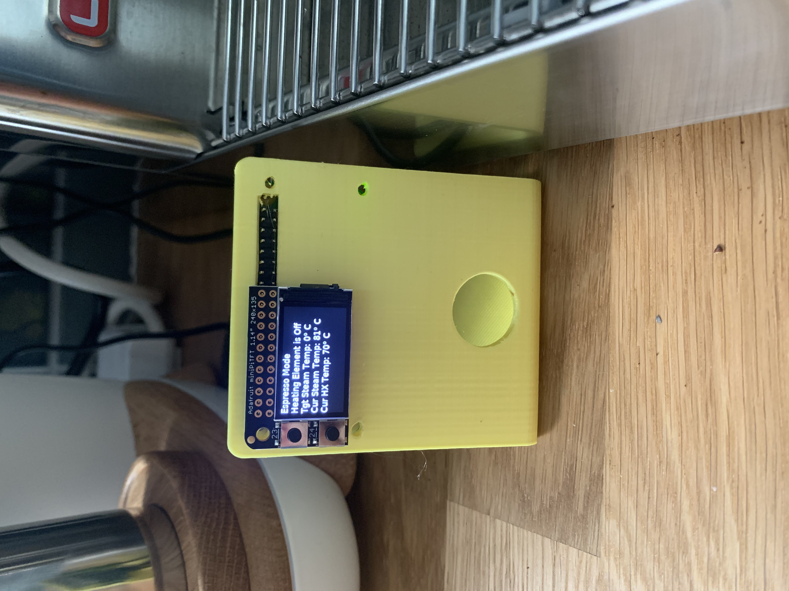

# lelit-mara-x-rpi-temperature
Temperature Display from Lelit Mara X using Raspberry Pi

Inspired by this youtube video to have a display: https://www.youtube.com/watch?v=9NL6yeq7sMM

With some help from this reddit post:
https://old.reddit.com/r/Coffee/comments/hfsvep/data_visualisation_lelit_marax_mod/

## Hardware:

* Lelit Mara X
* Raspberry Pi Zero W w/ headers (https://www.adafruit.com/product/3708)
* Adafruit Mini PiTFT (https://www.adafruit.com/product/4393)
* PL2303 USB to TTL Serial cable
(https://smile.amazon.com/gp/product/B00QT7LQ88/)
* MicroSD Card
* OTG MicroUSB Adapter (https://www.adafruit.com/product/2910)

### Hardware Install:
Connect the Green Wire of the Serial cable to the 3rd pin on the most left bank and the white wire to the 4th pin. (TXD to 3, RXD to 4)

Connect the PiTFT Board to the Raspberry Pi, connect the USB Serial cable to the RPI as well.

### Software Install

**Note**: This software is not perfect, it does not follow best practices and has some shortcuts. There might be bugs with regards to the code. Please use your judgement and understand the shortcomings of this package before use. The author takes no responsibilities for issues that might pertain due to the use of this code.

Format a MicroSD with Raspbian and set up the necessary wifi and ssh steps.

SSH into the server and follow the setup for Adafruit Mini piTFT (python3 support and not kernel: https://learn.adafruit.com/adafruit-mini-pitft-135x240-color-tft-add-on-for-raspberry-pi/python-setup).

You should have Adafruit's RGB Display Library, DejaVu Font, Pillow Library, and NumPy Library installed.

Install other requirements by running `sudo pip3 install -r requirements.txt`

Optional: Change `is_fahrenheit` in `temp_display.py` to `True` if you want to use fahrenheit and not celcius in the data.

Try out the script with the espresso machine is on to see if it prints out the correct values! `sudo python3 temp_display.py`

If everything looks great, then run the install script (./install.sh) and it should set the python script to run on boot and to restart when the process gets removed!

Reboot and enjoy.

Need to make changes?
make sure you change the file in `/usr/local/lib/marax-temp-display/temp_display.py` and not the local one.

